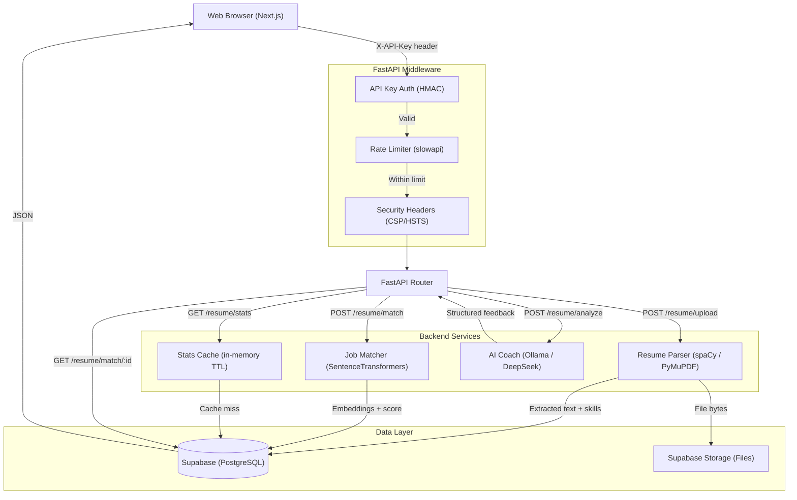

<div align="center">

  <h1>Resume Analyzer & Job Matcher</h1>
  
  <p>
    <strong>A Production-Grade AI Toolkit for HR Tech</strong>
  </p>

  <p>
    <a href="#features">Features</a> •
    <a href="#tech-stack">Tech Stack</a> •
    <a href="#architecture">Architecture</a> •
    <a href="#getting-started">Getting Started</a> •
    <a href="#api-documentation">API Docs</a>
  </p>

</div>

---

## Overview

**Resume Analyzer** is a sophisticated, open-source tool designed to bridge the gap between talent acquisition and candidate preparation. It leverages Natural Language Processing (NLP) and Machine Learning to parse resumes, extract key skills, and semantically match candidates against job descriptions.

Built with a modern tech stack (FastAPI, Next.js, Supabase) and integrated with local LLMs via Ollama (DeepSeek/Mistral), this project demonstrates a scalable, secure, and performant architecture suitable for enterprise HR solutions.

## Features

- **Smart Resume Parsing**: Automatically extracts contact info, skills, education, and work experience from PDF and DOCX files using `spaCy` and `PyMuPDF`.
- **Semantic Job Matching**: Uses `SentenceTransformers` to calculate a semantic similarity score between a resume and a job description, going beyond simple keyword matching.
- **AI Career Coach**: Integrates with **Ollama** (running **DeepSeek** or **Mistral**) to provide qualitative feedback, identifying strengths, weaknesses, and actionable improvements.
- **Match History**: Browse all past analyses, search through them, and click into any match for a full detailed report including a score ring and skill radar chart.
- **Interactive Dashboard**: A polished, responsive UI built with `Next.js` and `Shadcn/UI` with skeleton loaders and toast notifications.
- **Secure & Private**: Data stored securely in Supabase. API key authentication, constant-time comparison, input sanitization, and strict security headers (CSP, HSTS, Permissions-Policy) throughout.

## Tech Stack

### Backend
- **Framework**: [FastAPI](https://fastapi.tiangolo.com/) - High-performance async Python framework.
- **LLM Integration**: [Ollama](https://ollama.com/) - Local LLM runner (supporting DeepSeek, Mistral, Llama 3).
- **NLP**: [spaCy](https://spacy.io/) & [SentenceTransformers](https://www.sbert.net/) - For advanced text processing and embeddings.
- **PDF Processing**: [PyMuPDF](https://pymupdf.readthedocs.io/) - Fast and robust PDF extraction.
- **Database**: [Supabase](https://supabase.com/) (PostgreSQL) - Scalable relational database with real-time capabilities.

### Frontend
- **Framework**: [Next.js 15](https://nextjs.org/) (App Router) - The React framework for the web.
- **Language**: [TypeScript](https://www.typescriptlang.org/) - For type-safe code.
- **Styling**: [Tailwind CSS](https://tailwindcss.com/) - Utility-first CSS framework.
- **Components**: [Shadcn/UI](https://ui.shadcn.com/) - Beautifully designed components.
- **Charts**: [Recharts](https://recharts.org/) - Composable charting for skill radar and score visualisations.
- **Notifications**: [Sonner](https://sonner.emilkowal.ski/) - Toast notification system.
- **Icons**: [Lucide React](https://lucide.dev/) - Consistent icon set.

### Tooling
- **Linting & Formatting**: `ruff` (Python), `eslint` (TypeScript).
- **Testing**: `pytest` (Backend).

## Architecture



## Getting Started

### Prerequisites

- **Docker Desktop** (Recommended)
- **Node.js 18+** & **Python 3.10+** (For local dev without Docker)
- **Supabase Account** (For database connection)
- **Ollama** installed locally (For AI Coach features)

### Local LLM Setup (Ollama)

To use the AI Coach features, you need Ollama running locally.

1.  Download and install [Ollama](https://ollama.com/).
2.  Pull the DeepSeek model (or your preferred model):
    ```bash
    ollama pull deepseek-r1:1.5b
    ```
3.  Ensure your `backend/.env` file is configured:
    ```env
    OLLAMA_BASE_URL=http://localhost:11434
    OLLAMA_MODEL=deepseek-r1:1.5b
    ```

### Quick Start with Docker

1.  **Clone the repository**
    ```bash
    git clone https://github.com/Clufy/resume-analyzer.git
    cd resume-analyzer
    ```

2.  **Configure Environment**
    Create a `.env` file in the `backend` and `frontend` directories based on `.env.example`.

3.  **Run with Docker Compose**
    ```bash
    docker-compose up --build
    ```
    - Frontend: `http://localhost:3000`
    - Backend API: `http://localhost:8000`
    - API Docs: `http://localhost:8000/docs`

### Manual Local Setup

<details>
<summary><strong>Backend Setup</strong></summary>

```bash
cd backend
python -m venv .venv
# Windows
.venv\Scripts\activate
# Mac/Linux
source .venv/bin/activate

pip install -r requirements.txt
uvicorn main:app --reload
```
</details>

<details>
<summary><strong>Frontend Setup</strong></summary>

```bash
cd frontend
npm install
npm run dev
```
</details>

## API Documentation

Once the backend is running, you can access the interactive API documentation:

- **Swagger UI**: `http://localhost:8000/docs`
- **ReDoc**: `http://localhost:8000/redoc`

## Testing

```bash
cd backend
pytest
```

## Contributing

Contributions are welcome! Please feel free to submit a Pull Request.

1. Fork the Project
2. Create your Feature Branch (`git checkout -b feature/AmazingFeature`)
3. Commit your Changes (`git commit -m 'Add some AmazingFeature'`)
4. Push to the Branch (`git push origin feature/AmazingFeature`)
5. Open a Pull Request

## License

Distributed under the MIT License. See `LICENSE` for more information.
